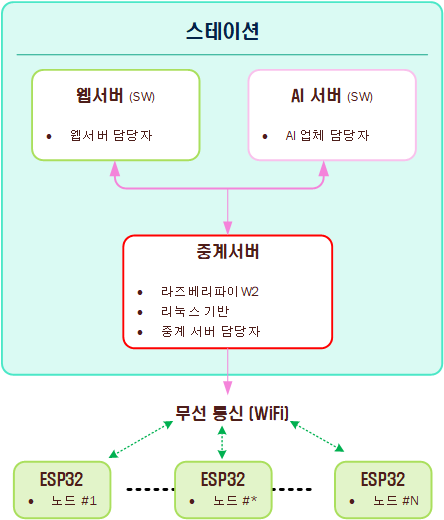

# 산책로 스마트 CCTV 시스템 개발 계획 (수정본)

안녕하세요, 피드백 감사합니다. 말씀해주신 대로 시스템 아키텍처를 수정했습니다. 중계서버가 라즈베리파이 W2 기반의 리눅스 시스템이고, 웹서버(SW)와 AI서버(SW)는 '스테이션'이라는 하나의 컴퓨터 내에서 동작하며, 중계서버도 동일한 공간에 위치한다는 내용을 반영했습니다.

## 1. 시스템 구성 개요 (수정)

산책로 스마트 CCTV 시스템은 다음과 같은 주요 구성 요소로 이루어집니다:


위의 블럭도는 앞으로 개선할 사항으로 시간과 비용이 추가되어야 하기 때문에,
다음과 같이 현실적인 대안을 제시합니다.
(아래의 블럭도는 기본적인 동작이 완료된 내용입니다)


### 1.1. 주요 구성 요소

1. **ESP32 노드 장치** (담당: 귀하)
   - 카메라 모듈 포함
   - 거리 센서 포함
   - Wi-Fi 통신 모듈 포함
   - LED 조명 제어 기능

2. **스테이션** (물리적 하드웨어, 윈도우 기반)
   - 중계서버, 웹서버, AI서버가 모두 이 하드웨어 내에 존재

   a. **중계서버** (담당: 귀하)
      - 라즈베리파이 W2 기반 (리눅스)
      - ESP32 노드 장치들의 데이터 수집 및 관리
      - MQTT 브로커 운영
      - HTTP 파일 서버 운영
      - 데이터베이스 관리

   b. **웹 서버** (타 업체 담당)
      - 사용자 인터페이스 제공
      - 중계서버 데이터 활용
      - API를 통한 AI 서버와의 통신

   c. **AI 서버** (타 업체 담당)
      - 이미지 분석
      - 사람 인식 및 카운팅
      - 이상 행동 감지 (넘어짐, 이상 거동 등)
      - 화재 감지

## 2. 수정된 시스템 아키텍처

### 2.1. 물리적 아키텍처


### 2.2. 논리적 아키텍처


## 3. ESP32 노드 장치 개발 계획

### 3.1. 하드웨어 구성

ESP32 노드 장치는 다음과 같은 하드웨어로 구성됩니다:

- ESP32 메인 보드 (Wi-Fi 기능 포함)
- 카메라 모듈
- 거리 측정 센서
- LED 조명 (측면 2개, 정면 1개)
- Wi-Fi 안테나
- 전원 관련 회로

### 3.2. 주요 기능

1. **이미지 캡처 및 전송**
   - 20초마다 자동 캡처
   - HTTP 프로토콜을 통한 이미지 파일 전송
   - 전송 시 MQTT로 메타데이터(MAC 주소, 날짜/시간, 파일명) 전송

2. **거리 센서 데이터 처리**
   - 2초 주기로 거리 센서 데이터 수집
   - MQTT 프로토콜을 통한 데이터 전송
   - MAC 주소, 시간, 거리 정보, 조명 밝기 정보 포함

3. **조명 제어**
   - 서버 명령에 따른 LED 조명 켜기/끄기
   - 밝기 조절(%) 기능
   - 자동/수동 모드 전환

4. **시스템 안정성 유지**
   - Wi-Fi 연결 모니터링 및 자동 재연결
   - 일정 시간 동안 명령 수신이 없을 경우 시스템 리셋
   - 카메라 및 거리센서 동작 상태 모니터링

### 3.3. 개발 단계

1. **하드웨어 인터페이스 개발**
   - ESP32와 카메라 모듈 연결 및 테스트
   - ESP32와 거리센서 연결 및 테스트
   - LED 조명 제어 회로 구성 및 테스트

2. **통신 기능 개발**
   - Wi-Fi 연결 기능 구현
   - MQTT 클라이언트 기능 구현
   - HTTP 파일 전송 기능 구현

3. **시스템 통합 및 테스트**
   - 카메라 캡처 및 전송 테스트
   - 거리 센서 데이터 수집 및 전송 테스트
   - 서버 명령에 따른 조명 제어 테스트
   - 전체 시스템 통합 테스트

## 4. 중계서버 개발 계획 (수정)

### 4.1. 하드웨어 구성

- 라즈베리파이 W2 (리눅스 기반)
- 스테이션 내부에 위치
- 안정적인 전원 공급 장치
- 필요시 외부 저장장치 연결 가능

### 4.2. 주요 기능

1. **데이터 수집 및 저장**
   - HTTP를 통해 수신된 이미지 파일 저장
   - MQTT를 통해 수신된 센서 데이터 처리 및 DB 저장
   - 노드 장치 정보 관리 (MAC 주소, 위치 정보 등)

2. **MQTT 브로커 운영**
   - 노드 장치와의 통신을 위한 MQTT 브로커 운영
   - 토픽: "cctv1_dev_pub", "cctv1_dev_sub"
   - AI 서버와의 통신을 위한 토픽: "cctv1_ai_pub", "cctv1_ai_sub"

3. **조명 제어 로직**
   - 거리 센서 데이터 기반 인접 노드 조명 제어
   - 사용자 설정에 따른 조명 제어 규칙 적용
   - 타이머 기반 자동 소등 기능 (30초 후)

4. **데이터베이스 관리**
   - 사용자 정보, 노드 장치 정보, 이미지 메타데이터, 센서 데이터 저장
   - DB명: uno_cctv
   - 테이블명: cctv_Info

5. **웹 서버와의 연동**
   - 웹 서버에 필요한 데이터 제공
   - API를 통한 정보 교환

### 4.3. 개발 단계

1. **서버 환경 구성**
   - 라즈베리파이 W2에 리눅스 OS 설치 및 구성
   - MQTT 브로커 설치 및 설정
   - HTTP 파일 서버 설치 및 설정
   - 데이터베이스 설치 및 스키마 설계

2. **주요 서비스 개발**
   - 노드 장치 관리 서비스
   - 이미지 수신 및 저장 서비스
   - 센서 데이터 처리 서비스
   - 조명 제어 서비스

3. **데이터베이스 연동**
   - 수신된 데이터 DB 저장 기능
   - 이미지 메타데이터 관리
   - 장치 상태 정보 관리

4. **웹 서버 및 AI 서버 연동**
   - 웹 서버에 데이터 제공을 위한 API 개발
   - AI 서버와의 데이터 교환 체계 구축

## 5. 스테이션 내의 서버 간 통신

### 5.1. 중계서버와 웹서버 간 통신

1. **데이터 공유 방식**
   - 내부 네트워크를 통한 직접 통신
   - 공유 데이터베이스 활용
   - REST API를 통한 데이터 교환

2. **주요 교환 데이터**
   - 노드 장치 정보 및 상태
   - 이미지 파일 위치 정보
   - 센서 데이터
   - 사용자 설정 정보

### 5.2. 중계서버와 AI서버 간 통신

1. **데이터 공유 방식**
   - MQTT 프로토콜 활용 (cctv1_ai_pub, cctv1_ai_sub 토픽)
   - 공유 폴더를 통한 이미지 파일 접근

2. **주요 교환 데이터**
   - 분석이 필요한 이미지 파일 위치 정보
   - AI 분석 결과 (인식된 사람 수, 이상 행동 등)
   - 이벤트 발생 정보 (밀집도 초과, 환자 발생 등)

### 5.3. 웹서버와 AI서버 간 통신

1. **데이터 공유 방식**
   - API를 통한 직접 통신
   - 내부 네트워크 활용

2. **주요 교환 데이터**
   - AI 분석 결과 (웹 인터페이스 표시용)
   - 이벤트 알림 정보
   - 웹 서버에서 전달하는 AI 설정 정보

## 6. 통신 프로토콜

### 6.1. MQTT 프로토콜

**MQTT 서버 정보:**
- IP: 14.58.82.158
- Port: 41883

**주요 토픽:**
1. `cctv1_dev_sub`: 노드 → 중계서버 (정보 전송)
2. `cctv1_dev_pub`: 중계서버 → 노드 (명령 전송)
3. `cctv1_ai_sub`: AI → 중계서버 (정보/이벤트 전송)
4. `cctv1_ai_pub`: 중계서버 → AI (명령 전송)

**주요 메시지 형식 (예시):**

```json
// 노드에서 서버로 정보 전송
{
  "mac_address": "XX:XX:XX:XX:XX:XX",
  "ip_address": "192.168.1.X",
  "dateTime": "2025-05-11 12:34:56",
  "count_of_person": 2
}

// 서버에서 노드로 캡처 명령
{
  "mac_address_server": "XX:XX:XX:XX:XX:XX",
  "ip_address_server": "192.168.1.1",
  "mac_address_node": "XX:XX:XX:XX:XX:XX",
  "dateTime": "2025-05-11 12:34:56",
  "command": "capture"
}
```

### 6.2. HTTP 파일 전송

- 이미지 파일은 HTTP를 통해 전송
- 파일명은 MAC_시간.jpg 형식으로 저장
- 파일 전송 완료 후 MQTT로 메타데이터 전송

## 7. 데이터베이스 설계

### 7.1. 기본 정보

- 데이터베이스명: uno_cctv
- 사용자: uno_cctv
- 비밀번호: uno1234

### 7.2. 주요 테이블

1. **노드 장치 테이블**
   - MAC 주소 (PK)
   - 노드 번호
   - 위치 정보 (GPS 좌표)
   - 장치 상태
   - 카메라 유무
   - 인접 노드 정보

2. **이미지 메타데이터 테이블**
   - 이미지 ID (PK)
   - 노드 MAC 주소 (FK)
   - 촬영 시간
   - 파일 경로
   - 이미지 사이즈

3. **센서 데이터 테이블**
   - 데이터 ID (PK)
   - 노드 MAC 주소 (FK)
   - 측정 시간
   - 거리 값
   - 조명 상태

4. **이벤트 로그 테이블**
   - 이벤트 ID (PK)
   - 이벤트 유형
   - 발생 시간
   - 관련 노드
   - 이벤트 세부 정보

## 8. 구현 계획 및 일정

### 8.1. ESP32 노드 장치 개발

1. **1주차: 하드웨어 인터페이스 개발**
   - ESP32 기본 설정 및 테스트
   - 카메라 모듈 연결 및 이미지 캡처 테스트
   - 거리 센서 연결 및 데이터 읽기 테스트
   - LED 조명 제어 테스트

2. **2주차: 통신 기능 개발**
   - Wi-Fi 연결 기능 구현
   - MQTT 클라이언트 기능 구현
   - HTTP 파일 전송 기능 구현
   - 기본 통신 테스트

3. **3주차: 기능 통합 및 최적화**
   - 카메라 캡처 및 전송 기능 통합
   - 거리 센서 데이터 처리 및 전송 통합
   - 조명 제어 기능 통합
   - 전력 소비 최적화 및 안정성 향상

4. **4주차: 테스트 및 디버깅**
   - 개별 기능 테스트
   - 통합 테스트 및 디버깅
   - 예외 상황 처리 기능 개선

### 8.2. 중계서버 개발

1. **1주차: 서버 환경 설정**
   - 라즈베리파이 W2 리눅스 환경 설정
   - MQTT 브로커 설치 및 설정
   - HTTP 파일 서버 설치 및 설정
   - 데이터베이스 설치 및 스키마 설계

2. **2-3주차: 핵심 서비스 개발**
   - 노드 장치 관리 서비스 개발
   - 이미지 수신 및 저장 서비스 개발
   - 센서 데이터 처리 서비스 개발
   - 조명 제어 서비스 개발
   - 데이터베이스 연동 구현

3. **4주차: 웹/AI 서버 연동 및 테스트**
   - 웹 서버 연동 인터페이스 개발
   - AI 서버 연동 인터페이스 개발
   - 통합 테스트 및 디버깅

### 8.3. 통합 테스트 및 배포

1. **5주차: 테스트베드 구축 및 통합 테스트**
   - 소규모 노드 네트워크 구축
   - 전체 시스템 통합 테스트
   - 성능 및 안정성 테스트

2. **6주차: 문제점 개선 및 최종 테스트**
   - 발견된 문제 해결
   - 성능 최적화
   - 최종 테스트 및 검수

3. **7-8주차: 현장 설치 및 안정화**
   - 현장 설치 지원
   - 문제 발생 시 원격 대응
   - 시스템 모니터링 및 안정화

## 9. 라즈베리파이 W2 기반 중계서버 개발 상세 계획

### 9.1. 시스템 요구사항

- Raspberry Pi W2
- 64-bit Linux 운영체제 (우분투 서버 또는 라즈비안)
- 최소 16GB MicroSD 카드
- 라즈베리파이용 공식 전원 어댑터

### 9.2. 소프트웨어 스택

- MQTT 브로커: Mosquitto
- 웹서버: Nginx 또는 Apache
- 데이터베이스: MariaDB 또는 SQLite
- 프로그래밍 언어: Python, Node.js

### 9.3. 핵심 서비스 구성

1. **노드 관리 서비스**
   - Python 기반 서비스
   - ESP32 노드 장치 등록 및 관리
   - 상태 모니터링 및 로깅

2. **이미지 처리 서비스**
   - HTTP 요청 수신 및 이미지 저장
   - 이미지 메타데이터 DB 저장
   - 저장된 이미지에 대한 접근 제공

3. **MQTT 처리 서비스**
   - Mosquitto MQTT 브로커 운영
   - 센서 데이터 수신 및 처리
   - 노드 장치로 명령 전송

4. **조명 제어 서비스**
   - 거리 센서 데이터 기반 로직
   - 조명 자동/수동 제어
   - 웹/AI 서버의 명령 처리

## 10. 시스템 통합 및 안정화 방안

### 10.1. 스테이션 내 서버 통합

- 중계서버(라즈베리파이 W2)와 스테이션 컴퓨터(웹서버, AI서버) 간의 네트워크 구성
- 내부 IP 할당 및 고정 IP 설정
- 방화벽 설정 및 보안 구성

### 10.2. 시스템 안정화 방안

1. **자동 복구 메커니즘**
   - 서비스 감시 데몬 구현
   - 문제 발생 시 자동 재시작
   - 주기적 시스템 상태 체크

2. **로깅 및 모니터링**
   - 상세한 로그 기록
   - 시스템 리소스 모니터링
   - 이벤트 알림 시스템

3. **원격 관리 방안**
   - SSH 접속 설정
   - 원격 모니터링 도구 구성
   - 안전한 원격 접근 정책

## 마무리

산책로 스마트 CCTV 시스템 개발 계획은 ESP32 기반 노드 장치와 라즈베리파이 W2 기반의 중계서버를 중심으로 구성됩니다. 중계서버, 웹서버, AI서버 모두 스테이션이라는 하나의 물리적 공간에 위치하며, 중계서버는 라즈베리파이 W2 기반의 리눅스 시스템으로 개발될 예정입니다.

본 계획을 통해 효율적인 시스템 구축과 안정적인 운영이 가능할 것으로 기대됩니다. 웹 서버와 AI 서버를 개발하는 타 업체와의 긴밀한 협업을 통해 사용자에게 가치 있는 서비스를 제공할 수 있을 것입니다.

개발 과정에서 발생할 수 있는 문제점을 사전에 예측하고 대응 방안을 마련하여, 프로젝트의 성공적인 완수를 위해 노력하겠습니다.
